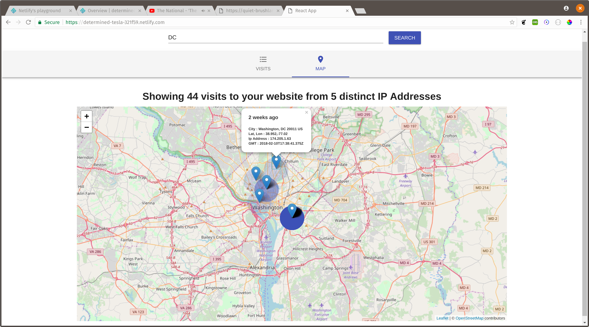

# websiteAnalytics-frontend

This is the front end to a [go-mongo REST server I wrote](https://github.com/dgoldstein1/websiteAnalytics-backend) to track visitors to my personal website. It contains a list view (infinite scroll) and map view mapping out all visits and their frequency by ip address.



To visit the deployed version go to https://determined-tesla-321f59.netlify.com.


# Development

### Setup

1. Clone the project

```
git clone https://github.com/dgoldstein1/websiteAnalytics-frontend.git
cd websiteAnalytics-frontend
```

2. Build and up containers

```
npm install
docker-compose up -d --build
```

3. Navigate to http://localhost:3000/ in your browser.

4. If you'd like to add some sample data you can copy over a mock database from the `test` folder:

```
# down all containers
docker-compose down
# copy over data
sudo cp -r test/data/* docker/mongodb/data/
# restart containers
docker-compose up -d
```

Open up `appConfig.js` and set `visitServerEndpoint` to `"http://localhost:5000/visits"`, then allow CORS in your browser.

# Deployment

This app is deployed through netifly. To generate a production build, run

```sh
# re-create build directory
rm -rf build && npm run build
# set redirect / cors enviroment for production
echo "/api/metrics/* https://quiet-brushlands-26130.herokuapp.com/visits 200" >> ./build/_redirects
```

Then push up to the master branch. There is webhook which will automatically deploy the `./build` directory.

## Authors

* **David Goldstein** - [DavidCharlesGoldstein.com](http://www.davidcharlesgoldstein.com/) - [Decipher Technology Studios](http://deciphernow.com/)

## License

This project is licensed under the MIT License - see the [LICENSE.md](LICENSE.md) file for details
